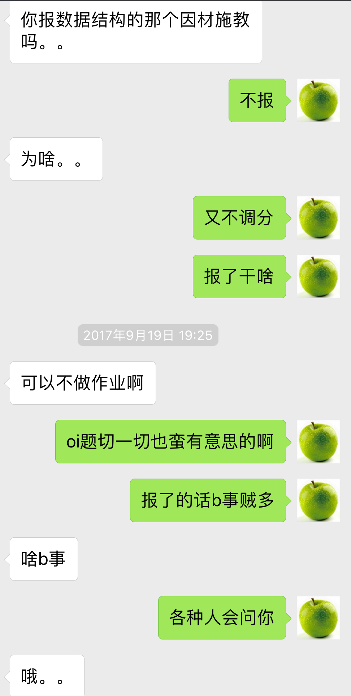

不知道该写什么好。

<!-- more -->

只好靠自己票圈来回忆一下了

## 小学期之前

整个暑假都在肝escape routing的东西。之前OOP考试的时候姚老师说能不能再改进一下算法，然后我就接了这个锅。先是写完了专利申请，之后暑假靠着聿浩之前大作业里面写的底层，自己慢慢搞。

感觉自己想出来了一个毒瘤算法，不出出来可惜了，于是就去毒瘤FJ省队集训……成功做到让ysy整场比赛都在玩结果啥都没搞出来2333。但是他的搞法还是给了我一定的启发，顺着搞下去就能搞出optimal solution。

差不多是7月底的时候代码都出来了，结果也出来了，可以看[这里](https://trinkle23897.github.io/demo.html)。然后写论文，由于自己英文水平太差，只好先随便写写，然后让老师一句一句改（真是辛苦），每次都是远程通话，每天，差不多2-4h一天。

剩下的时间在学习如何使用tikz画插图，画了有快十张放到论文里面。

然后就滚去上课了。

## 小学期

感觉也没啥事吧。其实就是不想面对回忆。

第一周的[数独](https://github.com/Trinkle23897/sudoku-qt5)还被评为优秀大作业

第二周的[国际跳棋](https://github.com/Trinkle23897/draughts-qt5)

第三周的[人物信息检索系统](https://github.com/Trinkle23897/list_of_people)

聿浩真的太强了！第三周作业还没正式出来的时候他已经做完了。orz

舍友们的C++小学期突然变成鬼畜。什么final exam因为中主电脑中病毒被取消了，然后大作业占了80%，在大作业里面文档又占了很大一部分分数，于是手把手教舍友LaTeX

## 九月以后

听黄大大的建议选了软工。然后向黄大大要了一节网安。然后手动选了软工。

由于3-1本来是杨大伯突然变成姚捕头，然后听完第一节课之后想方设法换课，最后在lyh的帮助下成功拉了一条5个人的换课链。

剩下都是常规操作了。

软工要选Project，某天晚上我们几个人讨论选啥好，我本来的倾向是做游戏，但是后面听说是前端爆肝之后还是放弃意见了。然后这个时候zgg突然打电话给miskcoo说能不能加一个人，理由是他之前的队去做游戏了感觉不靠谱（比如Sensetime的sdk出了锅谁来负责之类的）。我们几个开始还不想收他，后面想想还是收了。

选了个“可定制审批系统”，大概的锅有：审批逻辑、审批锁、内容定制、用户系统+权限管理、UI。现在想想感觉开始的时候看那些项目差别太大了，实际上就是【针对解决方案】+【用户系统+权限管理、UI】，后面那块差不多40%任务量。

然后又要开始学习django了……我是拒绝的。国庆前几天脑子也放假了，写什么都是bug，半夜抱着电脑问聿浩，太惨了……差点跟风退课……后面几天上手了还好说。

数据结构报小教员，zgg的意思是说不报，小教员没调分，pa就是oi题，像我这种还能体验刷常♂数的快♂感。记得之前黄大大还说小教员还要负责教主席树。还是不报了。有图为证：

真的是我当时内心真实想法。

所以我要想想为什么最后又报了。

对了征婚之风是wxz先用我的rank1程序刷了个榜然后给我搞的，然后就全系男同胞开始纷纷互相给自己舍友征婚。这样不好。

真的假装忘了怎么报的吧。找不到记录了。

还有就是之前那篇论文要改投一个会议，也是国庆的时候，要从13页压成8页。然后，过了一个月，没中。

之后每周就是肝软工的锅、肝软工的锅、肝软工的锅，由于前端只有tdl一个人人手不够然后我后端写成那个屎样子于是就被组长发配去写js，简简单单一个页面写了快七百行js真的要吐了。至于oj的题目就懒得做了。

12月的时候还搞了很多事情：

面基了lzr和xxc，反正都比我强。可能参加浩哥的婚礼中就我和zxx最菜了。

然后就是贵系有个学术新星计划，能够进实验室的。我当时琢磨着好不容易转系了这个资源不能不要，于是就报了朱军老师的实验室，怕报不上就随便报了三个其他的。结果都Accept了……所以就拒了其他三个然后进组了。

还去清华集训出了一道大水题，就是那种标算就是暴力的那种题。zgg怕出锅就又叫我连夜验了几遍吉利的题。

感觉在命题讨论会上只能听懂大概一半以下的题目？

学生节没参与多少，就只想当观众。平日一大爱好就是上b站看各种学生节dv剧，好像被我刷完了。emmm其实当个群演也是可以的，于是去舍友那边打了酱油，穿着贵系学生节的衣服演自动化班剧。蛤蛤蛤蛤

## 寒假之前

还是按照课程来吧……时间线的话真的记不起来了。

感觉gpa(t)单调递减，真是药丸

TODO

## 寒假

TODO