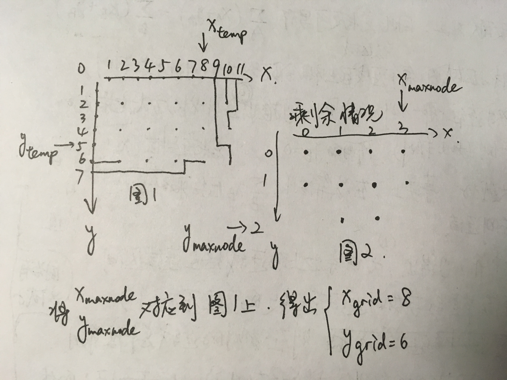
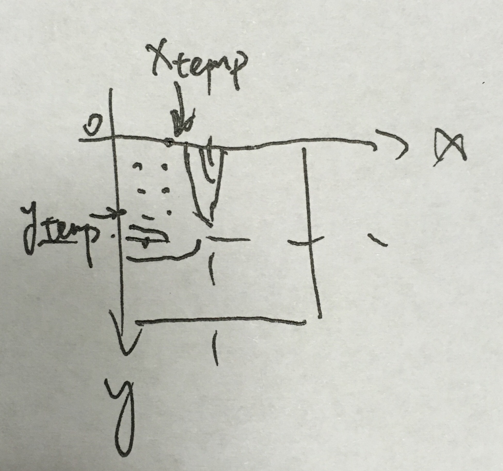

#  Definition

- 布线路径、连线起点、连线终点

- 边界：连线终点所在的边

- 坐标系/x轴/y轴：参考算法流程2

- $node_x,node_y$：芯片的连线起点的长度和宽度

- $d$：每个连线起点的间距/间隔/距离

- $grid_x,grid_y$：芯片总长度/宽度

- 水平中轴线、垂直中轴线

- （布线）子区域：把芯片按照两条中轴线四等分之后的区域，实际**只讨论最靠近原点的那个子区域**

  

- 芯片角落：参考4.2

- $x_{temp},y_{temp}$：在子区域中，位于x轴/y轴，并且尚未被占用的连线终点，最靠近中轴线的x坐标/y坐标。参考下图

  

- $x_{maxnode},y_{maxnode}$：子区域中未被连接的连线起点最靠近中轴线的是哪一行/列。参考上图

- $x_{grid},y_{grid}$：把上面两个变量映射成芯片上的坐标。参考上图

- 上半侧、左半侧：参考4.4.0

- $target_{x_1},target_{y_1}$：下一步上半侧/左半侧被选中的连线起点，分别可能连往$(x_{temp},0)$和$(0,y_{temp})$

# 算法流程

0. [算法的tex](https://cn.sharelatex.com/project/597f334596a5d57fcb797d1d)

1. 读入芯片的长度和宽度，记为  $ node_x,node_y $ 。

2. 利用二分法获取每个连线起点的间距  $ d $ ，可对应算出芯片的总长度 $ grid_x $ 和总宽度 $ grid_y $ ，根据以下公式进行计算：
   $$
   \begin{cases}grid_x=(node_x+1)\times d +1\\grid_y=(node_y+1)\times d+1\end{cases}
   $$
   并且对整个芯片建立平面直角坐标系，其中**左上角**为原点$(0,0)$，**向右**为$x$轴正方向，**向下**为$y$轴正方向。

   二分法的下界为$\left\lfloor\frac{node_x\times node_y}{2(node_x+node_y+2)}\right\rfloor$，可由方程$2\times(grid_x+grid_y)\ge node_x\times node_y$推导来，意思是每一个连线起点至少要有一个连线终点与它匹配；二分法上界为$\left\lfloor\frac{1}{2}(\min \{node_x,node_y\}+1)\right\rfloor$，可以证明当$d$等于该值的时候一定有解。

   经试验得知，令函数$f(x,y)=\left\lfloor0.59 \frac{xy}{x+y-1}+0.352\right\rfloor$，则最优解中$d$的值与$f(node_x,node_y)$的误差不超过$1$，在$\max\{node_x,node_y\}\le 200$的时候均成立。因此可认为$d=O(\frac{node_xnode_y}{node_x+node_y})$。

3. 连接靠近中轴线的某些连线起点

   3.0 定义函数 $Link\_out(S,T):$ $S$为连线起点，$T$为连线终点，该函数会寻找一条路径连接$S,T$，具体而言：

   ​	3.0.1 定义主方向：连线终点$T​$所在的边的方向，即：从$S​$出发，沿着该方向，一定能够到达连线终点$T​$所在的边；

   ​	3.0.2 定义辅方向：从$S$出发，到达$T$所在的边之后，去往$T$所在的方向；

   ​	3.0.3 连线步骤：从$S$出发，如果主方向上无障碍，并且还未到达$T$所在的边，则优先选择主方向；否则选择辅方向；

   3.1 将布线区域按照水平中轴线、垂直中轴线划分成4个等分的布线子区域

   3.2 如果$node_x$为奇数，则垂直中轴线与部分连线起点重合。将这些点按照从外到里的顺序，按照从外到内的奇偶顺序，左一个右一个地连出去（使用前述$Link\_out(S,T)$函数），直到这些点均被连接完成，或者两边的间距都被占满了。如下图所示（在这幅图中，$node_x=15,node_y=14,d=5$），上半侧居中的连线情况即为前述，其中左半侧为后者，右半侧为前者。$node_y$为奇数同理。

   

   3.3 如果$node_y$为偶数，则水平中轴线会将芯片上的连线起点划分成完全相等的两块区域。选中距离水平中轴线最近的两行，分别按照从外到内的奇偶顺序，上一个下一个地连出去（使用前述$Link\_out(S,T)$函数），直到这些点均被连接完成，或者中间的间距都被占满了。如下图所示，左右半侧的连线情况即为前述。$node_x$为偶数同理。

   <u>3.4 每一步连线时，均优先考虑剩余节点数多的一个子区域，在该区域选取连线起点进行布线。执行完上述步骤之后，每个区域内的连线情况应尽可能保持中心对称，并且未被连接的连线起点数目相差不超过1。</u>

4. 判断在该间距下，是否有可行的布线方案

   4.0 定义函数$Link\_in(S,T):$ $S$为预设的连线起点，$T$为连线终点，该函数会寻找一条可能的路径连接$S,T$，或者是求出更优的连线起点$M$，具体而言：

   ​	4.0.1 定义主方向：连线终点$T$所在的边的方向，即：从$S$出发，沿着该方向，一定能够到达连线终点$T$所在的边；

   ​	4.0.2 定义辅方向：从$S$出发，到达$T$所在的边之后，去往$T$所在的方向；

   ​	4.0.3 连线步骤：**从$T$出发**，如果辅方向的**反方向**上无障碍，并且到$S$的切比雪夫距离$>0$，则优先选择辅方向的**反方向**；否则选择主方向的**反方向**。若遇到未连通的连线起点$M$，则立即返回该节点。若两个方向上都有障碍，则返回布线失败。

   4.1 只需考虑左上部$\frac{1}{4}$区域该如何连线，若连线均成功，则可将整块芯片绕$x$轴或$y$轴翻转$180^\circ$，对其进行相同的处理步骤，即可完成整个芯片的布线。

   4.2 定义芯片的角落：在芯片的四个角落中，布线十分松散，称其为角落，如下图四个角落中$2\times 2$的连线起点区域。一个形式化的定义为：如果将所有的紧贴在一起的线认为是属于同一个连通块，那么所有不属于**步骤3连出的线所在的连通块**的线的区域为芯片的角落。

   

   4.3 定义四个指针和两个数组：

   

   ​	4.3.1 位于$x$轴，未被占用的连接终点$x_{temp}$。它满足$x_{temp}<\frac{1}{2}grid_x$，并且是该$\frac{1}{4}$区域中未被占用的连接终点坐标最大的；在下图中，$x_{temp}=17$

   ​	4.3.2 位于$y$轴，未被占用的连接终点$y_{temp}$。它满足$y_{temp}<\frac{1}{2}grid_y$，并且是该$\frac{1}{4}$区域中未被占用的连接终点坐标最大的；在下图中，$y_{temp}=18$

   ​	4.3.3 将该$\frac{1}{4}$区域内所有未被连线的连线起点投影到$x$轴，每一列上的点的个数储存在数组$res_x$中，$x$坐标最大的点坐标记为$x_{grid}$，其所在的列（从0开始编号）记为$x_{maxnode}$；在下图中，$x_{grid}=25,x_{maxnode}=4,res_x=\{3,3,4,2,1\}$

   ​	4.3.4 将该$\frac{1}{4}$区域内所有未被连线的连线起点投影到$y$轴，每一行上的点的个数储存在数组$res_y$中，$y$坐标最大的点坐标记为$y_{grid}$，其所在的行（从0开始编号）记为$y_{maxnode}$；在下图中，$y_{grid}=25,y_{maxnode}=4,res_y=\{3,3,4,2,1\}$

   

   4.4 连线步骤

   ​	4.4.0 定义长宽比例常数$rate=1.1$；记连往$x$轴的一侧为上半侧，连往$y$轴的一侧为左半侧。接下来的步骤循环执行。

   

   ​	4.4.1 若果满足条件 $$(x_{temp}-x_{grid})*2\ge res_x[x_{maxnode}]\And\And (y_{temp}-y_{grid})*2\ge res_y[y_{maxnode}]$$ ，则认为当前连线已经连至芯片角落，转4.4.6

   ​	4.4.2 若果满足条件 $\frac{x_{temp}}{y_{temp}}>rate || \frac{x_{maxnode}}{y_{maxnode}}>rate\&\&res_x[x_{maxnode}]>2$，则认为当前长宽比过高，下一步**必须**要在上半侧连一条线去往$x$轴，以减小长宽比，$force_x=1$，否则$force_x=0$；同理根据对称性可得，若果满足条件 $\frac{y_{temp}}{x_{temp}}>rate || \frac{y_{maxnode}}{x_{maxnode}}>rate\&\&res_y[y_{maxnode}]>2$，则认为当前长宽比过高，下一步**必须**要在左半侧连一条线去往$y$轴，以减小长宽比，$force_y=1$，否则$force_y=0$。

   ​	显然不可能同时有$force_x=1\&\&force_y=1$。如果某一个变量为1，那么接下来的步骤自动只考虑单独一侧的情况，而不用考虑另一侧的情况。

   ​	4.4.3 如果$x_{grid}<x_{temp}$，说明连线终点落后于连线起点，如上图的其他还未被连线区域。这个时候如果连一条线，大方向不是朝角落而是朝中间。此时选择$x_{maxnode}$所在的那一列，同步骤3.3左一个右一个地连出去，直到边界的被连线终点连续排列。由对称性可推出$y$方向上的情况。

   

   ​	4.4.4 对于上半侧而言，找出$x_{maxnode}$所在的那一列未被连接的起点中，$y$坐标最大的一个，记为$target_{x_0}$，调用函数$Link\_in(target_{x_0},(x_{temp},0))$。若该函数返回失败，并且对侧区域没有强制布线，即$force_y=0$，那么返回整个布线区域失败；若该函数返回一个点，则记其为$target_{x_1}$，将$x,y$对调可得出左半侧的情况，记返回的点为$target_{y_1}$。

   

   ​	4.4.5 如果强制只连一边，比如$force_x=1$，则直接调用函数$Link\_in(target_{x_1},(x_{temp},0))$，并且在最终的答案上记录下这一条线路。如果没有，则比较两条线路，将线路长度小的一条记录到答案中；并且对于剩下另一条线路（假设为$target_{y_1}$到$(0,y_{temp})$），如果曼哈顿距离$distance(target_{y_1},(0,y_{temp}))\le distance(target_{y_1},(x_{temp},0))$，说明当前线路已经是最优，不可能有更短的线路，也将其记录至答案中。

   ​	4.4.6 连接芯片角落：每次寻找某一行或者某一列，条件为，如果$x_{maxnode}>y_{maxnode}||x_{maxnode}==y_{maxnode}\&\&x_{temp}>y_{temp}$，则选取$x_{maxnode}$所在的一列，将其全部连接至$x$轴，同步骤3.3左一个右一个地连出去，直到这一整列点都连接完毕。否则选取$y_{maxnode}$所在的一行，同理。

5. 在确定了间隔$d$之后，如果某一个$\frac{1}{4}$区域无法完成布线任务，则返回间隔不合法，这样可以不用把整个芯片都计算一遍，节省许多时间。

   ​

# 运行效果

1:1

小数据

$err=\frac{algo-mcmf}{mcmf}\times 100\%$         $rate=\frac{mcmf\_runtime}{algo\_runtime}$

| $node_x\times node_y$ | $d$  | $grid_x\times grid_y$ | MCMF      | runtime/s  | Network Flow | runtime/s | err       | rate     | Rule      | runtime/s | err       | rate     |
| --------------------- | ---- | --------------------- | --------- | ---------- | ------------ | --------- | --------- | -------- | --------- | --------- | --------- | -------- |
| $16\times 16=256$     | $5$  | $86\times 86$         | $4832$    | $0.42$     | $4867$       | $0.03$    | $0.724\%$ | $14.000$ | $4832$    | $0.01$    | $0.000\%$ | $42.000$ |
| $22\times 22= 484 $   | $7$  | $162\times 162$       | $16632$   | $3.62$     | $16730$      | $0.15$    | $0.589\%$ | $24.133$ | $16632$   | $0.01$    | $0.000\%$ | $362.00$ |
| $27\times 27= 729 $   | $9$  | $253\times 253$       | $37433$   | $18.08$    | $37735$      | $0.54$    | $0.807\%$ | $33.481$ | $37433$   | $0.02$    | $0.000\%$ | $904.00$ |
| $32\times 32= 1024$   | $10$ | $331\times 331$       | $71520$   | $48.63$    | $71686$      | $2.21$    | $0.232\%$ | $22.005$ | $71520$   | $0.02$    | $0.000\%$ | $2431.5$ |
| $39\times 39= 1521$   | $12$ | $481\times 481$       | $155126$  | $185.13$   | $155446$     | $7.48$    | $0.206\%$ | $24.750$ | $155126$  | $0.03$    | $0.000\%$ | $6171.0$ |
| $45\times 45= 2025$   | $14$ | $645\times 645$       | $273183$  | $536.09$   | $273811$     | $18.99$   | $0.230\%$ | $28.230$ | $273183$  | $0.04$    | $0.000\%$ | $13402$  |
| $50\times 50= 2500$   | $15$ | $766\times 766$       | $411828$  | $982.59$   | $412246$     | $29.71$   | $0.101\%$ | $33.073$ | $411828$  | $0.05$    | $0.000\%$ | $19652$  |
| $55\times 55= 3025$   | $17$ | $953\times 953$       | $602856$  | $2302.68$  | $603975$     | $50.69$   | $0.186\%$ | $45.427$ | $602856$  | $0.07$    | $0.000\%$ | $32895$  |
| $59\times 59= 3481$   | $18$ | $1081\times 1081$     | $794321$  | $3801.38$  | $795454$     | $79.45$   | $0.143\%$ | $47.846$ | $794321$  | $0.09$    | $0.000\%$ | $42238$  |
| $63\times 63= 3969$   | $19$ | $1217\times 1217$     | $1028354$ | $6734.32$  | $1029553$    | $120.18$  | $0.117\%$ | $56.035$ | $1028354$ | $0.12$    | $0.000\%$ | $56119$  |
| $67\times 67= 4489$   | $20$ | $1361\times 1361$     | $1310859$ | $9606.02$  | $1312300$    | $168.03$  | $0.110\%$ | $57.168$ | $1310859$ | $0.14$    | $0.000\%$ | $68614$  |
| $71\times 71=5041$    | $22$ | $1585\times 1585$     | $1657902$ | $18233.13$ | $1660468$    | $234.78$  | $0.155\%$ | $77.660$ | $1657902$ | $0.19$    | $0.000\%$ | $95964$  |

rule 大数据

| $node_x\times node_y$  | $d$   | $grid_x\times grid_y$ | $Answer$     | 运行时间（以user计）/s | 运行内存（以maxresident计）/K |
| ---------------------- | ----- | --------------------- | ------------ | -------------- | --------------------- |
| $50\times 50=2500$     | $15$  | $766\times 766$       | $411828$     | $0.05$         | $71360$               |
| $100\times 100=10000$  | $30$  | $3031\times 3031$     | $6432660$    | $0.86$         | $130800$              |
| $150\times 150=22500$  | $45$  | $6796\times 6796$     | $32305488$   | $5.11$         | $322048$              |
| $200\times 200=40000$  | $59$  | $11860\times 11860$   | $101545352$  | $18.48$        | $781216$              |
| $250\times 250=62500$  | $74$  | $18575\times 18575$   | $247393944$  | $47.40$        | $1718000$             |
| $300\times 300=90000$  | $89$  | $26790\times 26790$   | $512277432$  | $103.67$       | $3393808$             |
| $350\times 350=122500$ | $103$ | $36154\times 36154$   | $947410336$  | $198.20$       | $6058704$             |
| $400\times 400=160000$ | $118$ | $47319\times 47319$   | $1615162688$ | $336.52$       | $10108368$            |
| $450\times 450=202500$ | $133$ | $59984\times 59984$   | $2585838036$ | $592.60$       | $15883104$            |
| $500\times 500=250000$ | $147$ | $73648\times 73648$   | $3937677256$ | $1318.17$      | $23570128$            |
| $550\times 550=302500$ | $162$ | $89263\times 89263$   | $5763426688$ | $2399.10$      | $34314816$            |

4:3

小数据

| $node_x\times node_y$ | $d$  | $grid_x\times grid_y$ | MCMF      | runtime/s  | Network Flow | runtime/s | err       | rate     | Rule      | runtime/s | err       | rate     |
| --------------------- | ---- | --------------------- | --------- | ---------- | ------------ | --------- | --------- | -------- | --------- | --------- | --------- | -------- |
| $18\times 13 =234$    | $5$  | $96\times 71$         | $3994$    | $0.37$     | $4054$       | $0.03$    | $1.502\%$ | $12.333$ | $3994$    | $0.01$    | $0.000\%$ | $37.000$ |
| $26\times 19 =494$    | $7$  | $190\times 141$       | $16702$   | $3.97$     | $16846$      | $0.15$    | $0.862\%$ | $26.467$ | $16702$   | $0.02$    | $0.000\%$ | $198.50$ |
| $32\times 24 =768$    | $9$  | $298\times 226$       | $39928$   | $19.54$    | $40244$      | $0.64$    | $0.791\%$ | $30.531$ | $39928$   | $0.02$    | $0.000\%$ | $977.00$ |
| $37\times 27 =999$    | $10$ | $381\times 281$       | $65993$   | $47.75$    | $66393$      | $1.56$    | $0.606\%$ | $30.609$ | $65993$   | $0.02$    | $0.000\%$ | $2387.5$ |
| $45\times 33 =1485$   | $12$ | $553\times 409$       | $143429$  | $183.21$   | $144087$     | $5.53$    | $0.459\%$ | $33.130$ | $143429$  | $0.03$    | $0.000\%$ | $6107.0$ |
| $52\times 39 =2028$   | $14$ | $743\times 561$       | $266146$  | $535.92$   | $267186$     | $17.10$   | $0.391\%$ | $31.340$ | $266150$  | $0.04$    | $0.002\%$ | $13398$  |
| $58\times 43 =2494$   | $15$ | $886\times 661$       | $397754$  | $993.35$   | $398686$     | $30.14$   | $0.234\%$ | $32.958$ | $397754$  | $0.05$    | $0.000\%$ | $19867$  |
| $64\times 48 =3072$   | $17$ | $1106\times 834$      | $603212$  | $2341.60$  | $604942$     | $45.91$   | $0.287\%$ | $51.004$ | $603212$  | $0.08$    | $0.000\%$ | $29270$  |
| $69\times 51 =3519$   | $18$ | $1261\times 937$      | $785910$  | $4041.30$  | $787926$     | $73.33$   | $0.257\%$ | $55.111$ | $785910$  | $0.09$    | $0.000\%$ | $44903$  |
| $74\times 55 =4070$   | $19$ | $1426\times 1065$     | $1047830$ | $6518.49$  | $1049897$    | $113.04$  | $0.197\%$ | $57.665$ | $1047830$ | $0.12$    | $0.000\%$ | $54321$  |
| $78\times 58 =4524$   | $20$ | $1581\times 1181$     | $1292072$ | $9849.57$  | $1294312$    | $160.68$  | $0.173\%$ | $61.299$ | $1292072$ | $0.15$    | $0.000\%$ | $65664$  |
| $82\times 61 =5002$   | $21$ | $1744\times 1303$     | $1576642$ | $14644.98$ | $1579640$    | $207.20$  | $0.190\%$ | $70.680$ | $1576642$ | $0.18$    | $0.000\%$ | $81361$  |

rule 大数据

| $node_x\times node_y$  | $d$   | $grid_x\times grid_y$ | $Answer$     | 运行时间（以user计）/s | 运行内存（以maxresident计）/K |
| ---------------------- | ----- | --------------------- | ------------ | -------------- | --------------------- |
| $80\times 60=4800$     | $21$  | $1702\times 1282$     | $1457620$    | $0.16$         | $81072$               |
| $160\times 120=19200$  | $41$  | $6602\times 4962$     | $22873656$   | $3.65$         | $245280$              |
| $240\times 180=43200$  | $61$  | $14702\times 11042$   | $115088948$  | $20.78$        | $881088$              |
| $320\times 240=76800$  | $81$  | $26002\times 19522$   | $362644552$  | $70.76$        | $2448400$             |
| $400\times 300=120000$ | $101$ | $40502\times 30402$   | $883782588$  | $189.90$       | $5711696$             |
| $480\times 360=172800$ | $121$ | $58202\times 43682$   | $1830446504$ | $406.71$       | $11418288$            |
| $560\times 420=235200$ | $141$ | $79102\times 59362$   | $3388278076$ | $1039.95$      | $20528864$            |
| $640\times 480=307200$ | $161$ | $103202\times 77442$  | $5776619592$ | $2140.61$      | $34443232$            |

# 复杂度分析

令$n=node_x,m=node_y$，不失一般性，令$n\ge m$。若不考虑之前的二分步骤，则

- 利用网络流/费用流算法求解，建出来的图顶点数为$O(nmd^2)$，边数为$O(nmd^2)$；由于$d=O(\frac{nm}{n+m})$，因此有$O(nmd^2)=O(\frac{n^3m^3}{(n+m)^2})$；

- 最小费用最大流（MCMF）算法时间复杂度为$O(n^3m^3d^4)$，空间复杂度为$O(nmd^2)$；特别地，当$m=O(n)$时，时间复杂度为$O(n^{10})$；当$n\gg m$时，时间复杂度为$O(n^3m^7)$；
    - $n$个点$m$条边的MCMF时间复杂度为$O(nm\cdot MaxFlow)$，空间复杂度为$O(n+m)$
- 网络流算法（用Dinic实现）时间复杂度为$O(n^{1.5}m^{1.5}d^3)$，空间复杂度为$O(nmd^2)$；特别地，当$m=O(n)$时，时间复杂度为$O(n^{6})$；当$n\gg m$时，时间复杂度为$O(n^{1.5}m^{4.5})$；
    - $n$个点$m$条边的**网格图**使用Dinic算法时间复杂度为$O(\min\{n^{2/3},m^{1/2}\}\cdot m)$，空间复杂度为$O(n+m)$

- 基于规则的布线算法时空复杂度均为$O(nmd^2)$；特别地，当$m=O(n)$时，时间复杂度为$O(n^4)$；当$n\gg m$时，时间复杂度为$O(nm^3)$。该复杂正比于输出规模，因此是理论下界。

# 为什么正方形能跑出最优解？

最优解有如下若干性质：

性质1：每一条边上的连线终点一定是 间断-连续-间断 地被连接，并且只有一段的连续区间。

性质2：四个区域中，每个区域的连线起点数目基本相等（差值不超过1）。

性质3：在步骤3中，所有被连接的连线起点只能往离它们最近的连出节点所在的边上连线。

----

定理1：存在一种划分方式，使得四个区域中连线起点数目相差不超过1。

证明：由对称性易得。

----

定理2：在步骤4.4.4和4.4.5中，每一步的连线都是在该局面状态下的最优方案。图片里的圈0

证明：根据该步骤的定义可知。

----

定理3：在该算法中，布线总长度只取决于连线终点的位置选择。

定理4：图片里的圈1

定理5：正方形的情况使用该算法一定能够跑出最优解。图片里的圈2

证明：[戳我](proof.jpg)

----

对于长方形而言，若长宽比例过高，则性质1、性质3有可能被破坏，不一定能够达到最优解。经过测试，在$\max \{node_x,node_y\}\le 100$的时候，所有情况中的绝对误差不超过90，并且在$\min\{node_x,node_y\}\ge 20$

的时候，相对误差不超过万分之8.3。

不是很会证明啊qwq……看起来没什么差别了可是52x39就是和最优解差了4我也不知道哪里多出来了啊qwqqwq

