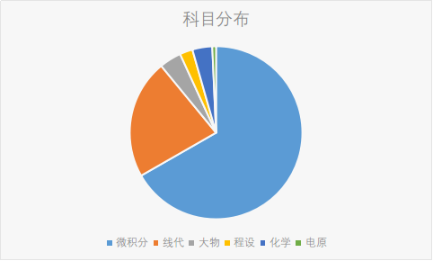
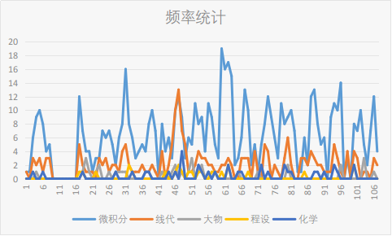
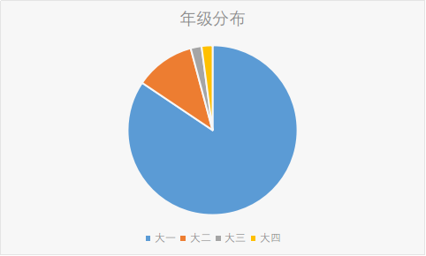
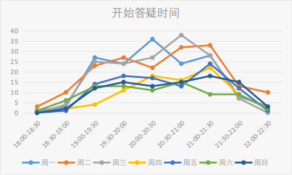
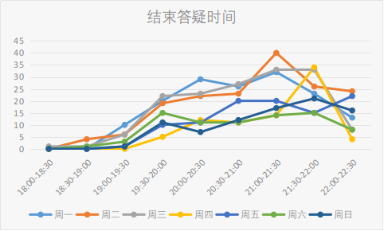

# 2017-2018秋季学期答疑坊反馈数据分析

1. 本学期有效填写答疑反馈情况总次数841，总人数289，平均每人来答疑2.91次

2. 科目

   

   微积分占比66.83%，线代占比22.18%，共89.0%；其他依次为大物、化学、程设，共10.2%

3. 时间相关性：呈周期分布，微积分和线代强相关

   线代期中考试为11月11日，最高峰出现在11/8，为13

   微积分期中考试为11/19，最高峰出现在11/21，为19，有点奇怪？

   

4. 院系相关性 总和不相等是因为一个人同时问多个科目

   以工科学微积分/线代的院系为主，不过像航院/数学系/物理系来的人极少，大概是太巨了

| 院系          | 人数   | 次数   | 微积分  | 线代   | 大物   | 程设   | 化学   | 电原   |
| ----------- | ---- | ---- | ---- | ---- | ---- | ---- | ---- | ---- |
| 建筑学院        | 23   | 82   | 74   | 4    | 4    | 3    | 0    | 0    |
| 生命科学学院      | 15   | 69   | 47   | 27   | 2    | 0    | 15   | 0    |
| 热能工程系       | 13   | 58   | 37   | 23   | 10   | 2    | 2    | 0    |
| 水利水电工程系     | 12   | 58   | 52   | 12   | 1    | 0    | 0    | 0    |
| 机械工程系       | 17   | 52   | 38   | 16   | 1    | 0    | 7    | 3    |
| 化学工程系       | 16   | 50   | 37   | 11   | 0    | 0    | 7    | 0    |
| 电子工程系       | 18   | 47   | 40   | 10   | 3    | 1    | 0    | 0    |
| 自动化系        | 17   | 44   | 37   | 9    | 1    | 6    | 0    | 0    |
| 计算机科学与技术系   | 17   | 43   | 33   | 15   | 1    | 5    | 0    | 0    |
| 汽车工程系       | 16   | 39   | 30   | 10   | 1    | 1    | 1    | 0    |
| 材料科学与工程学院   | 14   | 37   | 33   | 1    | 4    | 0    | 2    | 0    |
| 新雅书院        | 5    | 35   | 30   | 10   | 0    | 3    | 0    | 0    |
| 环境学院        | 13   | 30   | 24   | 5    | 2    | 0    | 0    | 3    |
| 经济管理学院      | 12   | 28   | 24   | 6    | 0    | 0    | 0    | 0    |
| 土木工程系       | 10   | 23   | 20   | 6    | 0    | 0    | 0    | 0    |
| 医学院         | 6    | 22   | 14   | 14   | 0    | 0    | 0    | 0    |
| 化学系         | 6    | 17   | 14   | 1    | 0    | 0    | 2    | 0    |
| 电机工程与应用电子技术 | 7    | 15   | 10   | 9    | 4    | 0    | 0    | 0    |
| 精密仪器与机械学系   | 4    | 15   | 15   | 3    | 0    | 0    | 0    | 0    |
| 社会科学学院      | 5    | 12   | 9    | 6    | 0    | 0    | 0    | 0    |
| 法学院         | 7    | 11   | 8    | 1    | 0    | 0    | 0    | 1    |
| 工业工程系       | 8    | 11   | 7    | 2    | 1    | 2    | 0    | 0    |
| 软件学院        | 6    | 11   | 9    | 6    | 0    | 0    | 0    | 0    |
| 工程物理系       | 4    | 10   | 6    | 6    | 5    | 1    | 0    | 0    |
| 航天航空学院      | 6    | 8    | 6    | 3    | 0    | 0    | 0    | 0    |
| 物理系         | 4    | 4    | 3    | 2    | 0    | 0    | 0    | 0    |
| 外文系         | 2    | 3    | 1    | 3    | 0    | 0    | 0    | 0    |
| 药学院         | 2    | 3    | 3    | 0    | 1    | 0    | 1    | 0    |
| 新闻与传播学院     | 2    | 2    | 1    | 1    | 0    | 0    | 0    | 0    |
| 建设管理系       | 1    | 1    | 1    | 0    | 0    | 0    | 0    | 0    |
| 数学科学系       | 1    | 1    | 1    | 0    | 0    | 0    | 0    | 0    |
| 总计          | 289  | 841  | 664  | 222  | 41   | 24   | 37   | 7    |

5. 年级 ('学号年份':[人数/次数])     {'2013': 1/2, '2014': 5/5, '2015': 6/12, '2016': 33/50, '2017': 244/772}

   

6. 平均每人每次询问1.19个科目

7. 开始答疑时间和结束答疑时间按照星期的分布情况。开始答疑时间是根据结束时间 减 服务时间，服务时间不一定准，仅供参考。大部分来的同学处于20:00-21:30时间区间中

   

   